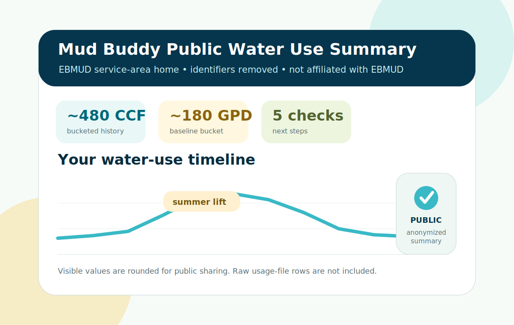
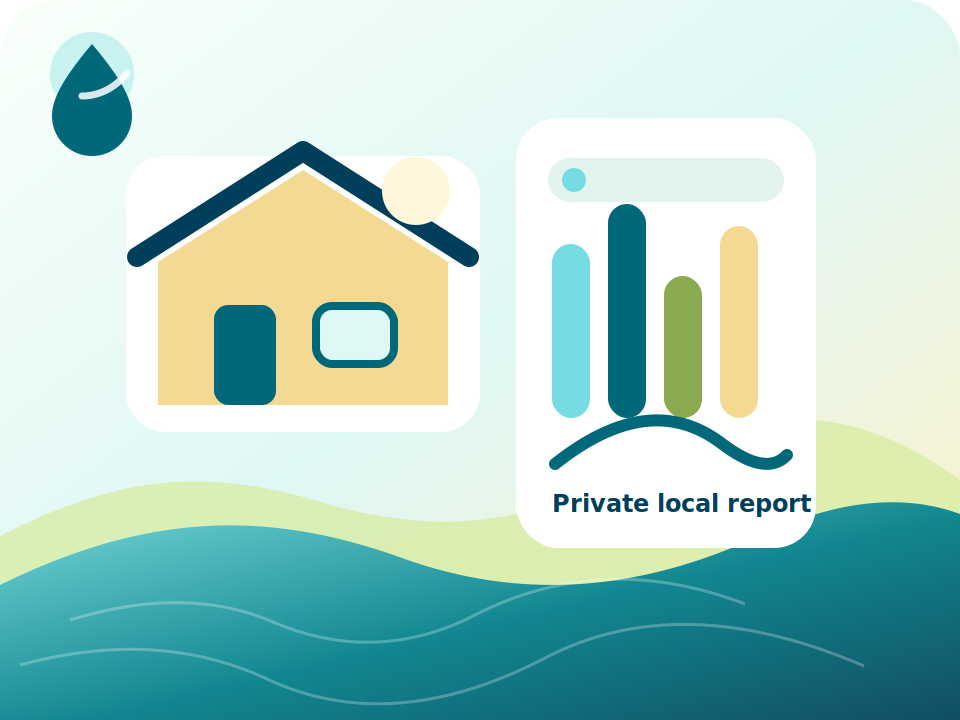
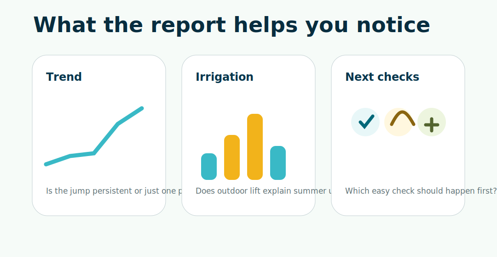

# Mud Buddy by Danno


[](https://github.com/danieloleary/mud-buddy/actions/workflows/ci.yml) [](https://github.com/danieloleary/mud-buddy/actions/workflows/pages.yml)

Mud Buddy turns an EBMUD water-use CSV into a private, plain-English report for homeowners, renters, gardeners, and East Bay households trying to understand high bills, irrigation season, baseline creep, possible leak clues, and what to check next.

It is free, local-first, and independent. Mud Buddy never needs your EBMUD password.

This project is not affiliated with EBMUD. It is not a formal water audit, plumbing inspection, leak detector, billing tool, certified conservation measurement, or official EBMUD analysis.

Mud Buddy helps interpret your exported CSV; official account, billing, emergency, rebate, and conservation actions happen on EBMUD's site.

## 1.0 mission: help save 1 million gallons this year

Mud Buddy's first public mission is to help East Bay households find **1 million gallons of potential water savings** this year.

That means helped-save or potential savings, not a verified EBMUD conservation total. The goal is to help people notice patterns sooner: irrigation schedules, baseline creep, running toilets, fixture checks, meter tests, and yard-water decisions.

Useful scale:

| Goal math | Why it matters |
| --- | --- |
| `1,000,000 gallons` | Clear public rallying goal. |
| `~1,337 CCF` | EBMUD defines 1 CCF as 748 gallons. |
| `~3.1 acre-feet` | A tangible water-supply scale. |
| `200 households x 5,000 gallons` | A realistic community path. |

Source context: EBMUD serves about 1.4 million people in a 332-square-mile water service area, and EBMUD rate materials define 1 CCF as 748 gallons. See [EBMUD service area](https://www.ebmud.com/about-us/who-we-are/service-area), [EBMUD FY2026 rate document](https://www.ebmud.com/download_file/force/34400/702?Rate_Document_for_FY_2026_Web.pdf=), and [docs/gallon-savings-methodology.md](docs/gallon-savings-methodology.md).

## For homeowners

Mud Buddy is for answering: "Why did our water use change, and what should we check next?"

You will need:

- An EBMUD account you can log into yourself.
- A downloaded EBMUD usage CSV.
- A computer where you can run a local command, or a trusted helper who can run it with you.

Mud Buddy does not log into EBMUD for you, does not need your password, and does not replace EBMUD customer support.

## What Mud Buddy helps answer

- Did our water use actually change, or was the bill period just longer?
- Is the jump mostly yard watering or irrigation season?
- Did our indoor baseline creep up as the household changed?
- Which billing period deserves attention first?
- Do the patterns suggest a toilet dye test, meter test, irrigation walk-through, or official EBMUD resource?

## When to use EBMUD directly

Use EBMUD directly for urgent issues, billing disputes, payment help, outages, pressure problems, water-quality concerns, rebates, assistance programs, or anything that needs an official account action.

Use Mud Buddy when you want to understand patterns in your exported usage CSV before deciding what to check next.

## Make a private local report

1. Log into EBMUD yourself in a normal browser session.
2. Download the official usage CSV from the Track Usage/export area.
3. Provide or upload the CSV to Mud Buddy only when you explicitly want it analyzed.
4. Run the report generator locally:

```bash
python scripts/generate_report.py "path/to/your-ebmud-export.csv" --out "generated/my-private-report"
```

5. Open `generated/my-private-report/index.html` locally.

For a shareable public summary, regenerate with `--public` and review [docs/public-sharing-checklist.md](docs/public-sharing-checklist.md):

```bash
python scripts/generate_report.py "path/to/your-ebmud-export.csv" --out "my-public-report" --public
npm run test:redaction
```

Private by default. Public sharing requires a separate public/redacted workflow.

## What it looks like



| Local analysis | Safe workflow | Official next steps |
| --- | --- | --- |
|  |  |  |



## Try it

- Live site: [https://danieloleary.github.io/mud-buddy/](https://danieloleary.github.io/mud-buddy/)
- GitHub repo: [https://github.com/danieloleary/mud-buddy](https://github.com/danieloleary/mud-buddy)
- Sample report: open the live site and choose `See example report`
- Installation notes: [docs/installation.md](docs/installation.md)
- Privacy notes: [docs/privacy.md](docs/privacy.md)
- Methodology: [docs/methodology.md](docs/methodology.md)

## Privacy boundary

Water usage can reveal household routines, so the default workflow is intentionally local.

- Your CSV stays on your computer unless you choose otherwise.
- No Mud Buddy account is required.
- Do not paste EBMUD credentials into Codex, Claude Code, Lovable, or any chat tool.
- Browser assistance starts only after you log into EBMUD manually.
- Public sharing should use `--public`; `--redact` removes direct identifiers but is not full anonymization.

If you ask an AI coding tool to help with browser control, tell it to wait while you log in manually, ask before operating an authenticated browser tab, and stop if the EBMUD portal is unclear.


## Official EBMUD resources

Mud Buddy is a private interpretation layer, not an official utility action center. If the issue looks urgent, billing-related, pressure/outage-related, water-quality-related, rebate-related, or assistance-related, use official EBMUD resources instead of over-interpreting Mud Buddy data.

| Need | Official EBMUD page |
| --- | --- |
| Customer starting point | [Customers](https://www.ebmud.com/customers) |
| Account access and My Water Report entry points | [Your account](https://www.ebmud.com/customers/account) |
| Track Usage and My Water Report guidance | [My Water Report Program](https://www.ebmud.com/water/conservation-and-rebates/my-water-report-program) |
| Bills, rates, payment questions, and account help | [Billing questions](https://www.ebmud.com/customers/billing-questions) |
| Patterns worth checking, high use, and leak guidance | [Leaks and high bills](https://www.ebmud.com/customers/billing-questions/leaks-and-high-bills) |
| Conservation services and rebates | [Conservation and rebates](https://www.ebmud.com/water/conservation-and-rebates) |
| Landscape, irrigation, and water-wise garden help | [WaterSmart gardener](https://www.ebmud.com/water/conservation-and-rebates/watersmart-gardener) |
| Outages, service alerts, and emergency notices | [Alerts and outages](https://www.ebmud.com/customers/alerts) |
| Water-quality reports and safety information | [Water quality](https://www.ebmud.com/water/about-your-water/water-quality) |
| Bill support for eligible customers | [Customer Assistance Program](https://www.ebmud.com/customers/customer-assistance-program) |
| Contact, emergency, and official support | [Contact / emergency](https://www.ebmud.com/contact-us) |

## Optional: use with Codex, Claude Code, or other AI coding tools

This is only for people who already use AI coding tools. Homeowners do not need this workflow to understand a report.

The safe workflow is still manual-login first, explicit CSV approval second, local analysis third.

- AI tool guide: [docs/use-with-ai-tools.md](docs/use-with-ai-tools.md)
- Codex agent rules: [AGENTS.md](AGENTS.md)
- Claude Code notes: [CLAUDE.md](CLAUDE.md)
- Browser-control safety: [docs/browser-control-safety.md](docs/browser-control-safety.md)
- Codex skill folder: [skills/ebmud-buddy](skills/ebmud-buddy)


Install the Codex skill:

```text
$skill-installer install https://github.com/danieloleary/mud-buddy/tree/main/skills/ebmud-buddy
```

## For maintainers

The demo and test files are here to make releases safer. Homeowners do not need to care about them.

- The only committed CSV is [examples/sample-ebmud-usage.csv](examples/sample-ebmud-usage.csv).
- Synthetic flavors are generated under ignored `tests/output/` for parser and report coverage.
- The mock browser portal is synthetic and never automates real EBMUD credentials.
- Dan's real CSV can be used locally for a private parse check, but it must never be committed, packaged, or published.

Useful release commands:

```bash
npm ci
npx playwright install chromium
npm run generate:sample
npm run generate:synthetic
npm run test:csv-provision
npm run test:synthetic
npm run validate
```

Release and QA docs:

- [docs/release-management.md](docs/release-management.md)
- [docs/release-checklist.md](docs/release-checklist.md)
- [docs/acceptance-criteria.md](docs/acceptance-criteria.md)
- [docs/backlog.md](docs/backlog.md)
- [SECURITY.md](SECURITY.md)
- [SUPPORT.md](SUPPORT.md)

## Launch status

Version 1.0.0 weekend release candidate. Feedback welcome from EBMUD customers, East Bay homeowners, renters, gardeners, conservation folks, civic-tech builders, and AI-tool power users.
