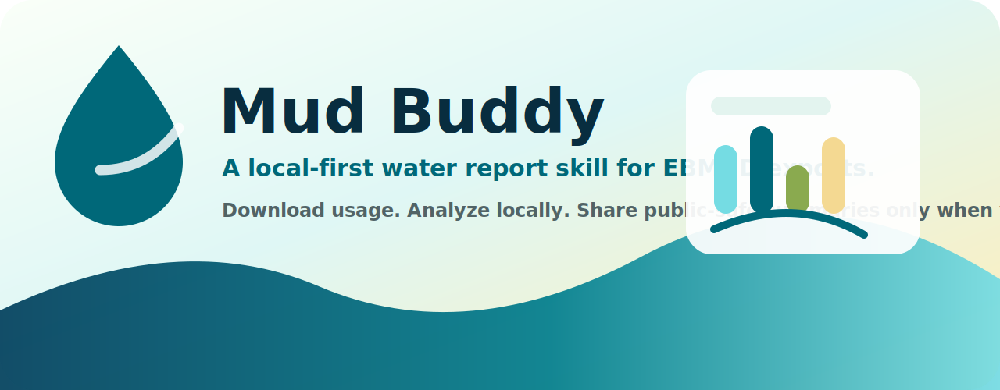
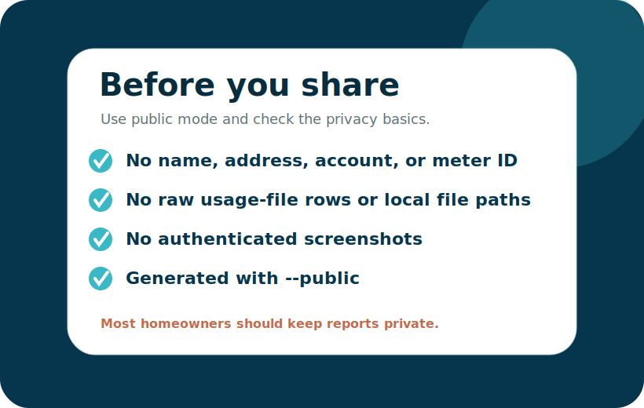
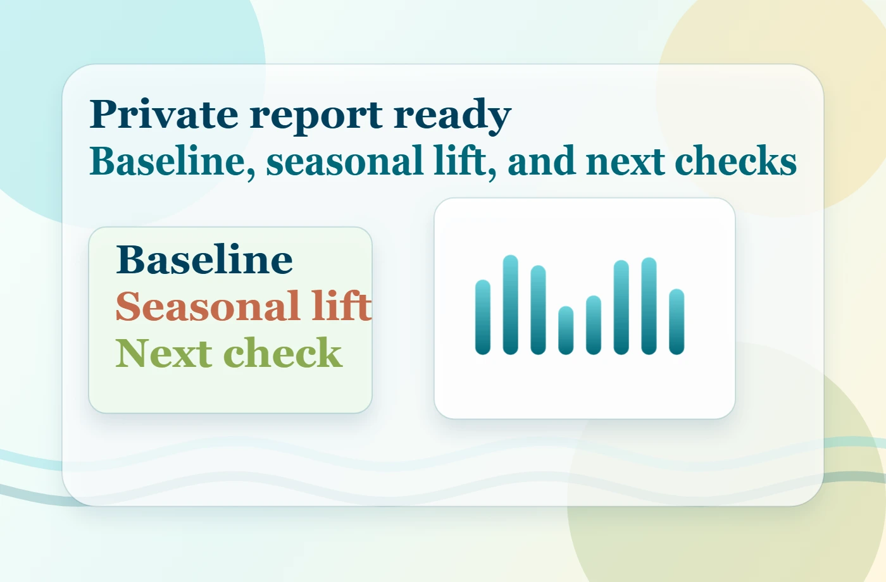
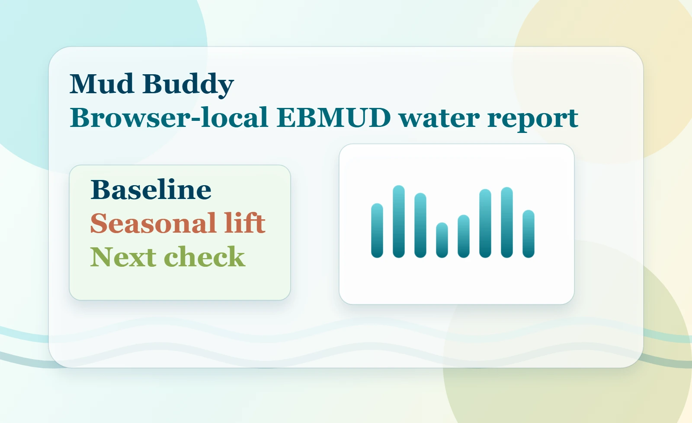
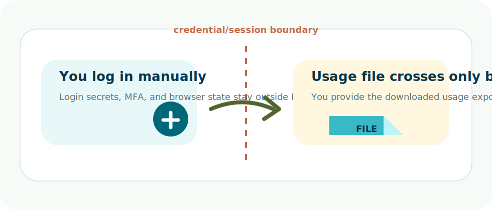
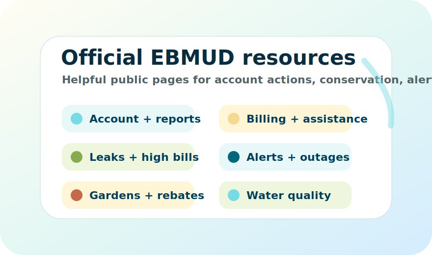
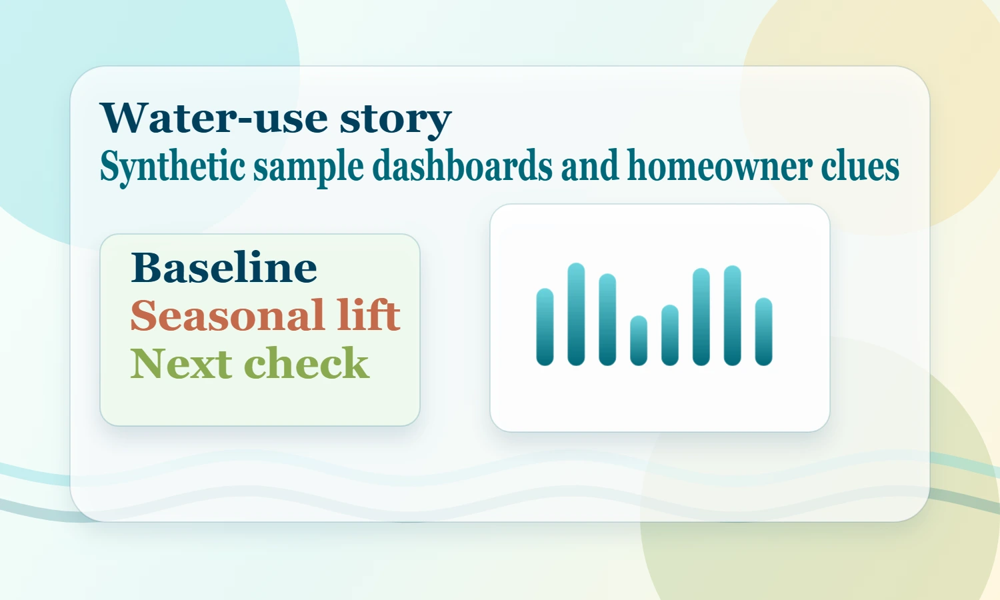
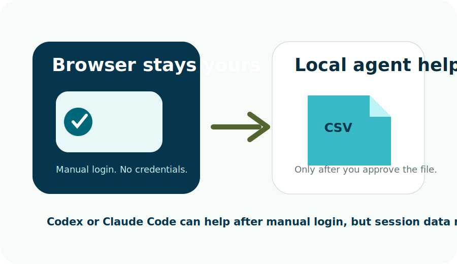

# Mud Buddy for EBMUD - by Dan O'Leary



[](https://github.com/danieloleary/mud-buddy/actions/workflows/ci.yml) [](https://github.com/danieloleary/mud-buddy/actions/workflows/pages.yml)

Mud Buddy turns an EBMUD water-use CSV into a private, plain-English water report for homeowners, renters, gardeners, and East Bay households asking a simple question: what changed in my water use, and what should I check first?

Use it here: [https://danieloleary.github.io/mud-buddy/](https://danieloleary.github.io/mud-buddy/)

It is free, browser-local, and independent. Mud Buddy never needs your EBMUD password. Your CSV is read in your browser and is not uploaded to a Mud Buddy server.

This project is not affiliated with EBMUD. It is not a formal water audit, plumbing inspection, leak detector, billing tool, certified conservation measurement, or official EBMUD analysis.

Mud Buddy helps interpret your exported CSV; official account, billing, emergency, rebate, and conservation actions happen on EBMUD's site.

## Use Mud Buddy in 3 steps

1. Log into EBMUD yourself and download your usage CSV from Track Usage or My Water Report.
2. Open [Mud Buddy](https://danieloleary.github.io/mud-buddy/) and choose `Analyze my CSV`.
3. Review the browser-local report: normal daily use, likely outdoor watering, the peak period, CSV notes, and practical next checks.

You can also choose `Try sample data` on the site to see the flow with synthetic public-safe data.

## What Mud Buddy helps answer

- Did our water use actually change, or was the bill period just longer?
- Is the jump mostly yard watering or irrigation season?
- Did our normal daily use change as the household changed?
- Which billing period deserves attention first?
- Do the patterns suggest a toilet dye test, meter test, irrigation walk-through, or official EBMUD resource?

## Mission: help save 1 million gallons this year

Mud Buddy's first public mission is to help East Bay households find **1 million gallons of potential water savings** this year.

That means helped-save or potential savings, not a verified EBMUD conservation total. The goal is to help people notice patterns sooner: irrigation schedules, baseline creep, running toilets, fixture checks, meter tests, and yard-water decisions.

| Goal math | Why it matters |
| --- | --- |
| `1,000,000 gallons` | Clear public rallying goal. |
| `~1,337 CCF` | EBMUD defines 1 CCF as 748 gallons. |
| `~3.1 acre-feet` | A tangible water-supply scale. |
| `200 households x 5,000 gallons` | A realistic community path. |

Source context: EBMUD serves about 1.4 million people in a 332-square-mile water service area, and EBMUD rate materials define 1 CCF as 748 gallons. See [EBMUD service area](https://www.ebmud.com/about-us/who-we-are/service-area), [EBMUD FY2026 rate document](https://www.ebmud.com/download_file/force/34400/702?Rate_Document_for_FY_2026_Web.pdf=), and [docs/gallon-savings-methodology.md](docs/gallon-savings-methodology.md).

## Privacy boundary

Water usage can reveal household routines, so the default workflow is intentionally private.

- Browser analyzer: the CSV is read with the browser file picker and is not uploaded to a Mud Buddy server.
- No Mud Buddy account is required.
- Mud Buddy does not display the private filename, account number, meter ID, raw CSV rows, or local file path in the browser report.
- Do not paste EBMUD credentials into Codex, Claude Code, Lovable, or any chat tool.
- Browser assistance starts only after you log into EBMUD manually.
- Public sharing should use `--public`; `--redact` removes direct identifiers but is not full anonymization.



## What it looks like



| Browser-local analysis | Safe CSV boundary | Official next steps |
| --- | --- | --- |
|  |  |  |



## When to use EBMUD directly

Use EBMUD directly for urgent issues, billing disputes, payment help, outages, pressure problems, water-quality concerns, rebates, assistance programs, or anything that needs an official account action.

Use Mud Buddy when you want to understand patterns in your exported usage CSV before deciding what to check next.

## Official EBMUD resources

| Need | Official EBMUD page |
| --- | --- |
| Customer starting point | [Customers](https://www.ebmud.com/customers) |
| Account access and My Water Report entry points | [Your account](https://www.ebmud.com/customers/account) |
| Track Usage and My Water Report guidance | [My Water Report Program](https://www.ebmud.com/water/conservation-and-rebates/my-water-report-program) |
| Bills, rates, payment questions, and account help | [Billing questions](https://www.ebmud.com/customers/billing-questions) |
| Patterns worth checking, high use, and leak guidance | [Leaks and high bills](https://www.ebmud.com/customers/billing-questions/leaks-and-high-bills) |
| Conservation services and rebates | [Conservation and rebates](https://www.ebmud.com/water/conservation-and-rebates) |
| Landscape, irrigation, and water-wise garden help | [WaterSmart gardener](https://www.ebmud.com/water/conservation-and-rebates/watersmart-gardener) |
| Outages, service alerts, and emergency notices | [Alerts and outages](https://www.ebmud.com/customers/alerts) |
| Water-quality reports and safety information | [Water quality](https://www.ebmud.com/water/about-your-water/water-quality) |
| Bill support for eligible customers | [Customer Assistance Program](https://www.ebmud.com/customers/customer-assistance-program) |
| Contact, emergency, and official support | [Contact / emergency](https://www.ebmud.com/contact-us) |

## Advanced local generator

Most homeowners can stop at the browser analyzer. Developers and AI-tool users can also generate a full local HTML/SVG report:

```bash
python scripts/generate_report.py "path/to/your-ebmud-export.csv" --out "generated/my-private-report"
```

For a shareable public summary, regenerate with `--public` and review [docs/public-sharing-checklist.md](docs/public-sharing-checklist.md):

```bash
python scripts/generate_report.py "path/to/your-ebmud-export.csv" --out "my-public-report" --public
npm run test:redaction
```

## Optional: use with Codex, Claude Code, or other AI coding tools

This is only for people who already use AI coding tools. Homeowners do not need this workflow to use the browser app.

- AI tool guide: [docs/use-with-ai-tools.md](docs/use-with-ai-tools.md)
- Codex agent rules: [AGENTS.md](AGENTS.md)
- Claude Code notes: [CLAUDE.md](CLAUDE.md)
- Browser-control safety: [docs/browser-control-safety.md](docs/browser-control-safety.md)
- Codex skill folder: [skills/ebmud-buddy](skills/ebmud-buddy)



Install the Codex skill:

```text
$skill-installer install https://github.com/danieloleary/mud-buddy/tree/main/skills/ebmud-buddy
```

## Try it, share it, follow along

- Live app: [https://danieloleary.github.io/mud-buddy/](https://danieloleary.github.io/mud-buddy/)
- GitHub repo: [https://github.com/danieloleary/mud-buddy](https://github.com/danieloleary/mud-buddy)
- Sample report: [https://danieloleary.github.io/mud-buddy/sample-report/index.html](https://danieloleary.github.io/mud-buddy/sample-report/index.html)
- X: [@danieloleary](https://x.com/danieloleary)
- LinkedIn: [Dan O'Leary](https://www.linkedin.com/in/danieloleary/)

## For maintainers

The demo and test files are here to make releases safer. Homeowners do not need to care about them.

- The only committed CSV is [examples/sample-ebmud-usage.csv](examples/sample-ebmud-usage.csv).
- The browser app receives CSV text only through explicit file selection or the synthetic sample-data button.
- Synthetic test cases are generated under ignored `tests/output/` for parser and report coverage.
- The mock browser portal is synthetic and never automates real EBMUD credentials.
- Dan's real CSV can be used locally for a private parse check, but it must never be committed, packaged, or published.

Useful release commands:

```bash
npm ci
npx playwright install chromium
npm run generate:sample
npm run generate:synthetic
npm run test:csv-parser
npm run test:browser-upload
npm run test:browser-upload-privacy
npm run test:browser-upload-network
npm run test:js-python-parity
npm run validate
```

Release and QA docs:

- [docs/release-management.md](docs/release-management.md)
- [docs/release-checklist.md](docs/release-checklist.md)
- [docs/acceptance-criteria.md](docs/acceptance-criteria.md)
- [docs/backlog.md](docs/backlog.md)
- [SECURITY.md](SECURITY.md)
- [SUPPORT.md](SUPPORT.md)

